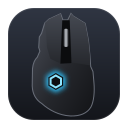
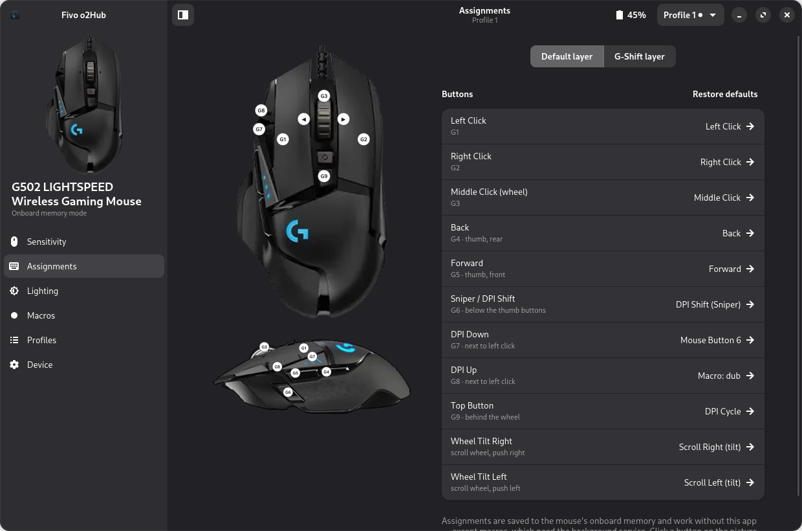
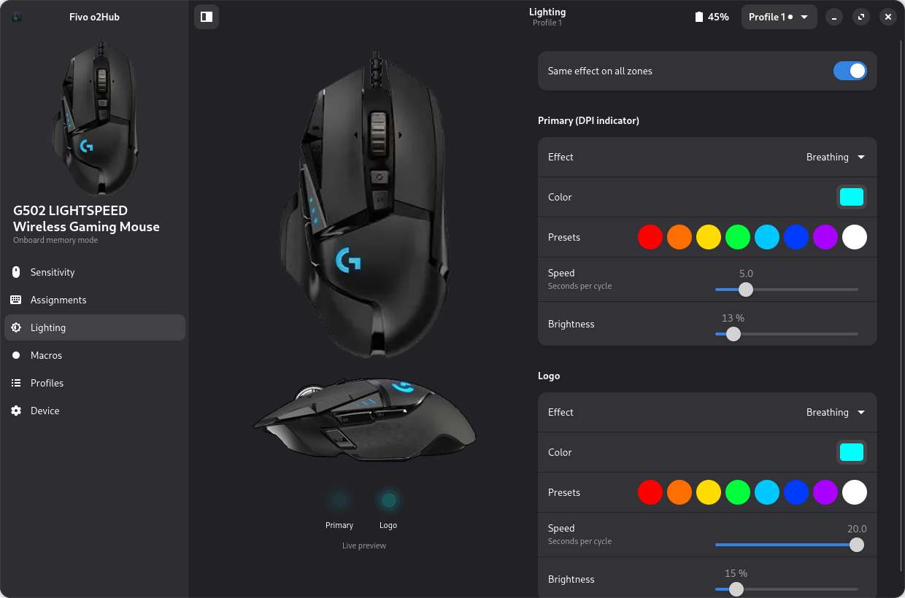
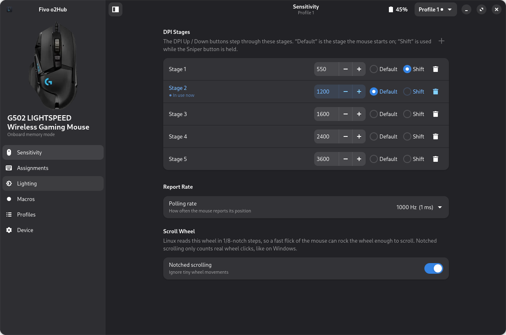

<p align="center">
  
</p>

<h1 align="center">Fivo o2Hub</h1>

<p align="center">
  Configure Logitech gaming mice on Linux: DPI, buttons, lighting, profiles and macros.<br>
  Native GTK 4 / libadwaita. No root, no extra daemons. It starts with the <b>G502</b>.
</p>

<p align="center">
  
</p>

## Features

| | |
|---|---|
| **Sensitivity** | Up to 5 DPI stages (100–25 600 in steps of 50). Pick the default stage and the Sniper / DPI-Shift stage, and set the polling rate from 125 to 1000 Hz. A live indicator shows the stage in use. **Notched scrolling** stops accidental scrolling when you move the mouse fast. |
| **Assignments** | Click a button on the photo (or in the list) to make it a mouse button, a key combination, a media key, DPI or profile switching, G-Shift, wheel tilt, a macro, or disabled. A second **G-Shift layer** works while G-Shift is held. |
| **Lighting** | DPI-indicator and logo zones: off, fixed, colour cycle or breathing, with speed, brightness and presets. A live animated preview shows the result. |
| **Macros** | Record or build key and mouse sequences with delays. Play them once, repeat while held, or toggle on/off. |
| **Profiles** | All 5 onboard profiles: enable, switch, rename, reset to factory. |
| **Device** | Battery (% and voltage), firmware, connection, and the background-service switches. |

**Everything except macros is saved in the mouse itself**, so it keeps
working with the app closed, at the login screen, and on other computers.

<p align="center">
  
  
</p>

### Supported devices

| Device | Status |
|---|---|
| G502 LIGHTSPEED (wireless, and via USB cable) | ✅ tested |
| G502 HERO / SE and other G502 variants | should work (same profile format), please report |
| Other Logitech mice with onboard memory | the backend is generic; see [adding a new mouse](docs/ARCHITECTURE.md#adding-a-new-mouse) |

## Install

```bash
git clone <repo-url> fivo-o2hub && cd fivo-o2hub
./install.sh
```

The installer:

- installs dependencies (pacman, apt or dnf);
- installs a udev rule so your user can talk to the mouse;
- adds you to the `input` group (needed for macros; log out and in once);
- adds **Fivo o2Hub** to your app menu.

The installer also asks whether to use **notched scrolling** (see
troubleshooting); `--notched-scroll` / `--smooth-scroll` answer it up front.

**Starting at login is opt-in.** The installer asks, defaulting to *no*.
You can also decide up front:

```bash
./install.sh --autostart       # start the macro service at every login
./install.sh --no-autostart    # never
```

You can change it any time under **Device → Start at login**. Only macros
need the background service; everything else lives in the mouse.

To check your setup, run `python3 diagnostics.py`. To remove the app, run
`./uninstall.sh` (add `--purge` to also delete your saved macros).

**Dependencies:** Python 3, PyGObject with pycairo, GTK 4, libadwaita ≥ 1.6, librsvg,
and python-evdev.

## How macros work

A mouse has no idea what "repeat while held" means, so software plays the
macros:

1. Assigning a macro binds the button (on the mouse) to a spare key, F13 or
   above.
2. The **macro service** (a small systemd user service) takes over the
   mouse's input device. It passes every event straight through, except
   that key, which it replaces with your macro.

The app starts the service while you use macros. It follows the mouse
through sleep and reconnects, and touches nothing while no macro is
assigned.

## Troubleshooting

| Problem | Fix |
|---|---|
| "No mouse found" with a permissions hint | Run `./install.sh`, then re-plug the receiver |
| "The mouse is asleep" | Move it. The app reconnects by itself and saves pending changes |
| Macros don't fire | Device → Background Service → *Service log*. `EBUSY` means another tool (input-remapper, a VM…) holds the mouse; `python3 list_input_devices.py` shows which |
| Moving the mouse fast scrolls the page | Linux reads the wheel in 1/8-notch steps, so a flick rocks it enough to scroll. Turn on Sensitivity → **Notched scrolling**: only whole wheel clicks count, like on Windows. Log out and in to apply |
| A profile is messed up | Profiles → ↺ resets it to factory. Assignments → *Restore defaults* resets only the buttons |
| Using Piper / ratbagd too | They can coexist, but don't edit the mouse in both at once |

## Contributing

Bug reports, new devices and UI work are welcome. Start with
[CONTRIBUTING.md](CONTRIBUTING.md) and
[docs/ARCHITECTURE.md](docs/ARCHITECTURE.md). Every class and method is
documented in [docs/API.md](docs/API.md).

## Credits

The onboard-memory format knowledge builds on the excellent
[libratbag](https://github.com/libratbag/libratbag) project (MIT).

## Disclaimer

Fivo o2Hub is an independent project. It is not affiliated with, endorsed
by, or sponsored by Logitech. Logitech, LIGHTSPEED and G502 are trademarks
of Logitech; they are used here only to identify compatible hardware.
Product photos in `data/devices/` are © Logitech (background removed) and are
used only to identify the device. The app icon is an original drawing.
