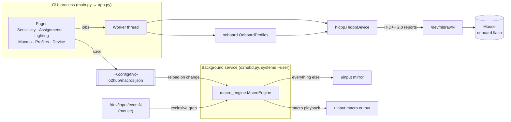

# Architecture

This is the map of Fivo o2Hub for contributors. Read it first, then use
[API.md](API.md) for every class and method.

## The big picture



There are two independent halves:

1. **Settings.** The GUI talks HID++ to the mouse and edits its onboard
   memory: DPI, polling rate, buttons, lighting and profiles. The mouse
   stores all of it, so nothing has to keep running afterwards.
2. **Macros.** These are the only feature that needs software at runtime.
   A button is bound (on the mouse) to a spare *trigger key*. The
   background service grabs the mouse's input device, swallows that key,
   and plays the macro. The GUI and the service share only `macros.json`;
   there is no IPC.

## Design rules

- **Onboard first.** If the mouse can store something, store it there. It
  then works on other PCs, at the login screen, and with the app closed.
- **Never rebuild flash sectors from scratch.** `onboard.Profile` patches
  the raw bytes read from the device. Fields we don't understand
  (onboard macros, power settings, vendor bytes) survive untouched. The CRC
  is recomputed by `Profile.sealed()`.
- **One thread talks to the mouse.** All HID++ traffic goes through
  `app.Worker`, so requests never interleave and the UI never blocks on a
  sleeping wireless mouse. Results come back to GTK via `GLib.idle_add`.
- **The macro engine's event pump never blocks.** While the engine holds
  the mouse, every cursor movement passes through `MacroEngine._pump`. A
  stall there freezes the cursor. Device discovery therefore runs on its
  own thread, and only when `/dev/input` changes.
- **Edits are debounced, not "applied".** Pages mutate the in-memory
  `Profile` and call `MainWindow.schedule_save()`. 600 ms after the last
  change, the profile is written, and the mouse reloads it if it's live.

## HID++ 2.0 in five minutes (`hidpp.py`)

Every request is a 20-byte *long report*:

| byte | meaning |
|---|---|
| 0 | `0x11` (long report) |
| 1 | device index; `0xFF` for direct/USB. Through a receiver the kernel's `logitech-dj` driver fills it in |
| 2 | **feature index**, which differs per device |
| 3 | `function << 4 \| software_id` |
| 4–19 | parameters |

Features have fixed 16-bit **IDs** (e.g. `0x2201` Adjustable DPI). Each
device maps them to its own **indexes**. `HidppDevice.feature_index()`
asks the Root feature (`0x0000`) once and caches the answer.

A reply echoes bytes 2–3. An error comes back as feature `0xFF` (HID++ 2.0,
with an error code), or as `0x8F` from the receiver when the mouse is
unreachable; that one raises `DeviceOffline`. Because every program
reading the hidraw node sees every reply, we match on our software ID
(`sw_id`), so the app and other tools can coexist.

Features used: `0x0003` firmware, `0x0005` name, `0x1000/0x1001/0x1004`
battery, `0x2201` DPI, `0x8060` report rate, `0x8070` LED zones (info only),
and `0x8100` onboard profiles.

## Onboard memory (`onboard.py`)

Feature `0x8100` exposes flash as numbered **sectors**. On the G502
LIGHTSPEED they are 255 bytes each:

| sector | contents |
|---|---|
| `0x0000` | directory: `[addr_hi, addr_lo, enabled, 0]` × profiles, then `FF FF 00 00` |
| `0x0001`… | user profiles 1–5 |
| `0x0101`… | factory (ROM) profiles, read-only |

Every sector ends with a big-endian CRC-16/CCITT (`hidpp.crc_ccitt`).
The profile layout:

| offset | size | field |
|---|---|---|
| 0 | 1 | report rate as period in ms (1 = 1000 Hz) |
| 1 | 1 | default DPI stage |
| 2 | 1 | DPI-shift (sniper) stage |
| 3 | 10 | 5 × u16 **LE** DPI values (0 = unused) |
| 13 | 3 | profile colour |
| 28 / 30 | 2 / 2 | power-save / power-off timeouts |
| 32 | 64 | 16 × 4-byte button bindings |
| 96 | 64 | 16 × 4-byte G-Shift bindings |
| 160 | 48 | name (UTF-16LE on newer firmware) |
| 208 | 22 | 2 × 11-byte LED effects |
| 230 | 22 | 2 × 11-byte alternate LED effects |
| size−2 | 2 | CRC |

The button binding has 4 bytes:

| type | layout | meaning |
|---|---|---|
| `80 01 hh ll` | BE bitmask | mouse button (bit 0 = left) |
| `80 02 mm kk` | modifier bits, HID usage | keyboard key |
| `80 03 hh ll` | BE usage | consumer control (media) |
| `90 cc 00 pp` | function code | DPI/profile/G-Shift/tilt (`onboard.SPECIALS`) |
| `00 …` | page/offset | onboard macro (preserved, not editable) |
| `FF …` | | disabled |

An LED effect has 11 bytes: a mode byte (`00` off, `01` fixed, `03` cycle,
`0A` breathing), then mode-specific colour/period/intensity. See
`LedEffect.decode`.

After writing the active profile, `OnboardProfiles.save()` calls
`set_current_profile` so the mouse reloads it. It then restores the DPI
stage the user was on.

Reference: libratbag's `src/hidpp20.c` (MIT), which documents the same
format.

## Macros (`macros.py`, `macro_engine.py`, `o2hubd.py`, `service.py`)

1. The user builds a `Macro`: steps plus a `RepeatMode`. It is stored in
   `macros.json` by `MacroStore` (atomic writes).
2. Assigning it to a button picks a free trigger key
   (`keys.TRIGGER_KEYS`: F13–F24, then five JIS keys). The button is bound
   on the mouse to that key with no modifiers.
3. `o2hubd.py` runs `MacroEngine` under a systemd user unit. Once a second
   it checks `macros.json`'s mtime and reconfigures if it changed.
4. While at least one macro has a trigger, the engine:
   - finds the mouse's input node(s) whose name contains the hint
     (`G502`);
   - creates a **mirror** uinput device with the same name and IDs, so
     desktop pointer settings still apply;
   - grabs the real device and forwards every event to the mirror, except
     trigger keys;
   - plays macros on a separate **output** uinput device, one thread per
     playing macro, and always releases held keys when a macro stops.
5. With no triggers, it grabs nothing.

`service.py` keeps two choices separate: **running** (`start`/`stop`; the
app starts the service while macros are in use) and **autostart at login**
(`set_autostart`). Autostart is strictly opt-in.

## Notched scrolling (`scroll_quirk.py`)

The kernel's `hid-logitech-hidpp` driver switches wheels that support HID++
feature `0x2121` into high-resolution mode. On the G502 that means 8 events
per notch, emitted as `REL_WHEEL_HI_RES` (15 units each). Small wobbles
from moving the mouse fast therefore scroll the page. The kernel also
emits ordinary `REL_WHEEL` events, but only once the wheel has moved half a
notch in one direction, resetting the count on direction changes. Those
events ignore wobble.

Rather than fight the driver (re-setting the wheel mode would confuse the
kernel's scroll scaling, and it re-enables hi-res on reconnect), we add a
**libinput quirk** that disables `REL_WHEEL_HI_RES` / `REL_HWHEEL_HI_RES`
for matching devices:

```ini
[Fivo o2Hub notched scrolling 1]
MatchUdevType=mouse
MatchVendor=0x046D
MatchName=*G502*
AttrEventCode=-REL_WHEEL_HI_RES;-REL_HWHEEL_HI_RES;
```

libinput then emulates hi-res events from `REL_WHEEL`, so apps see normal
scroll events. The block lives between markers in
`/etc/libinput/local-overrides.quirks`, and other content is preserved. It
is written as root via `pkexec` from the app, or `sudo` from `install.sh`.
libinput loads quirks when the compositor starts, so changes need a log-out.
To add models, extend `scroll_quirk.MODELS`.

To check a quirk without root, use the `libinput quirks list --data-dir DIR
/dev/input/eventN` tool from the `libinput-tools` package, or set
`LIBINPUT_QUIRKS_DIR` for a process that creates a libinput context.

## The UI (`app.py`, `macro_ui.py`, `mouse_art.py`)

- `MainWindow` owns the device state and builds the pages. Each page is a
  plain class with `title`, `icon`, `widget` and `refresh()`. Optionally it
  also has `animate(t)` (called ~20×/s while visible) and `responsive`
  (boxes that switch to vertical on narrow windows).
- `mouse_art.MouseView` shows a transparent-background product photo from
  `data/devices/`, cropped to the mouse. It overlays numbered badges (an
  SVG rendered with librsvg) that act as buttons. The Lighting page's live
  preview is a set of animated colour dots, one per LED zone; the photos
  are not recoloured.
- Polling (`MainWindow.poll`, every 3 s) picks up profile or DPI changes
  made with the mouse's own buttons, battery level, and sleep/wake.

## Adding a new mouse

1. Plug it in and run `python3 diagnostics.py`. If it lists the device with
   `onboard profiles: yes`, the backend probably already works.
2. Check `OnboardProfiles` accepts its memory format (model `0x01`,
   macro format `0x01`). Other formats need work in `onboard.py`. Compare
   with libratbag.
3. Add physical button names to `devices.py` (`MODELS`), in onboard button
   index order. To find the order, assign distinct keys to each button and
   press them.
4. Optionally add photos. Put a top (and optionally side) image in
   `data/devices/`, then add one `Art` per view in `mouse_art.py`. Each
   `Art` sets `crop` (the region of the image to show) and `hotspots`
   (each button's position in the image's own pixel coordinates); register
   them in `ART_BY_MODEL`. If the photo has a white background, make it
   transparent first:
   `python3 tools/clear_background.py photo.png data/devices/model-top.png`.
   It only clears background connected to the image border and softens the
   edge, so light details on the mouse itself are kept.
5. Run `python3 tools/ui_snapshot.py` (see below) and look at every page.

## Testing

| What | How |
|---|---|
| Environment and mouse | `python3 diagnostics.py` (read-only) |
| Macro engine | `python3 test_macros.py`. It grabs the mouse for about 3 s and fires every repeat mode. Stop the service first (`systemctl --user stop fivo-o2hub`) |
| UI, visually | `kwin_wayland --virtual --socket o2snap &` then `WAYLAND_DISPLAY=o2snap python3 tools/ui_snapshot.py /tmp/shots` |
| Docs coverage | `python3 tools/gen_api_docs.py --check` |

When you change the profile format code, verify round trips on real
hardware. Read a sector, decode and re-encode it, and compare bytes
(`Profile.sealed()` must equal the original for an untouched profile).

## Files and paths

| Path | What |
|---|---|
| `~/.config/fivo-o2hub/macros.json` | saved macros |
| `~/.config/systemd/user/fivo-o2hub.service` | macro service unit (written by `service.install`) |
| `/etc/udev/rules.d/70-fivo-o2hub.rules` | hidraw and uinput access |
| `/etc/libinput/local-overrides.quirks` | marked block, only when notched scrolling is on |
| `~/.local/share/applications/com.fivo.o2Hub.desktop` | app-menu entry |

Names and IDs come from `appinfo.py`.
